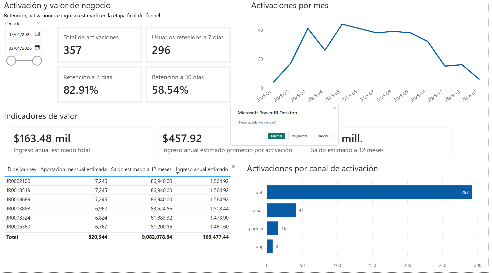
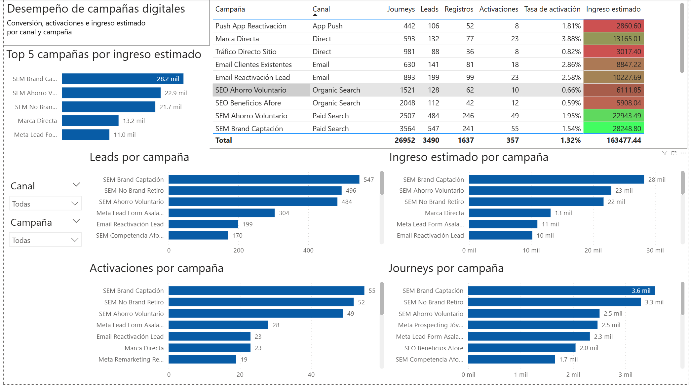
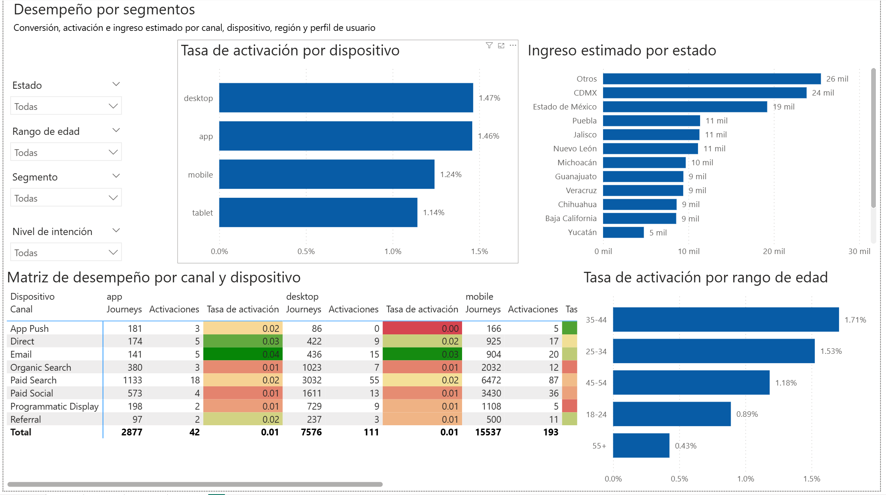
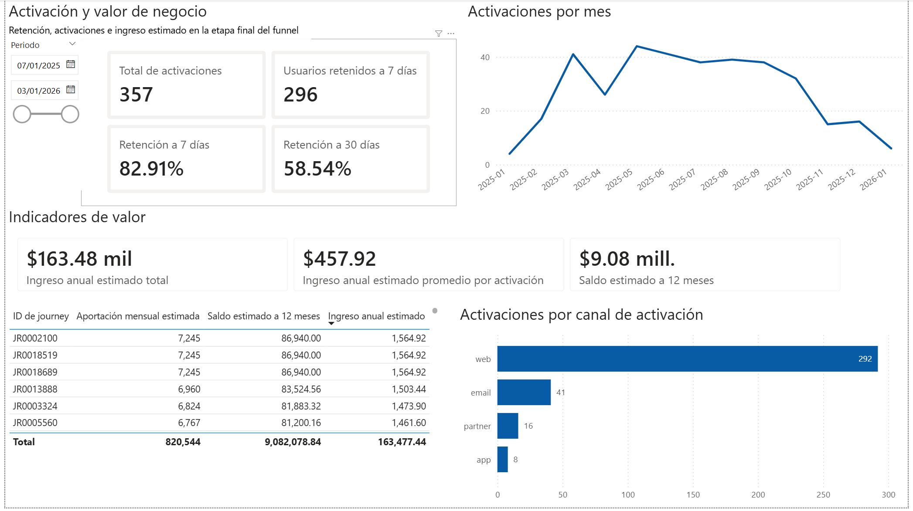

# Afore Digital Funnel Analytics

Caso de estudio end-to-end de analítica de datos aplicado a un funnel digital de captación, registro y activación en servicios financieros.  
El proyecto integra definición de negocio, modelado de datos, generación de base sintética, SQL analítico, Python, modelo predictivo y dashboard ejecutivo en Power BI.

## Resumen del proyecto

Este caso de estudio fue diseñado para simular un entorno realista de analítica digital en una Afore, con el objetivo de entender cómo evolucionan los usuarios desde la atracción inicial hasta la activación y el valor económico estimado.

El proyecto parte de una pregunta de negocio central: **cómo medir, entender y optimizar el funnel digital de captación, registro y activación**, identificando fugas, campañas más eficientes, segmentos de mayor valor y oportunidades de mejora.

## Objetivo

Construir un caso de analítica de negocio que permita:

- medir el desempeño del funnel digital;
- identificar los principales puntos de fuga;
- comparar campañas, canales, dispositivos y segmentos;
- estimar activación y valor económico;
- traducir hallazgos técnicos a un dashboard y a una narrativa de entrevista.

## Preguntas de negocio

Entre las preguntas principales del caso se encuentran:

- ¿En qué etapa del funnel se concentra la mayor pérdida de journeys?
- ¿Qué canales y campañas convierten mejor?
- ¿Qué segmentos muestran mayor activación?
- ¿Qué dispositivos presentan más fricción?
- ¿Cómo se comporta el ingreso estimado por campaña, canal o segmento?
- ¿Qué indicadores ejecutivos debería seguir un área de analítica o negocio?

## Stack utilizado

- **SQL**
- **Python**
- **Pandas**
- **Matplotlib**
- **Scikit-learn**
- **SQLite**
- **Power BI**
- **Mermaid** para documentación del modelo de datos

## Estructura del repositorio

### 1. Definición del caso de negocio
- [01_business_case/](01_business_case/)

Incluye:
- brief del proyecto;
- resumen ejecutivo;
- definición del problema;
- objetivos;
- hipótesis;
- KPIs;
- definición del funnel.

### 2. Modelo de datos
- [02_data_model/](02_data_model/)

Incluye:
- diccionario de datos;
- DER;
- modelo relacional;
- reglas de calidad;
- documentación del modelo en Mermaid.

### 3. Base sintética
- [03_synthetic_data/](03_synthetic_data/)

Incluye:
- base SQLite del proyecto;
- script generador;
- lógica de simulación;
- supuestos y limitaciones del dataset.

### 4. SQL base del funnel
- [04_sql_base/](04_sql_base/)

Incluye:
- validaciones de calidad;
- limpieza y deduplicación;
- joins principales;
- construcción de la vista maestra del funnel;
- métricas base de conversión y abandono.

### 5. SQL analítico
- [05_sql_analytics/](05_sql_analytics/)

Incluye:
- conversión por canal;
- conversión por dispositivo;
- conversión por región;
- análisis por segmento;
- revenue por canal;
- costo por conversión;
- calidad de campañas;
- KPIs ejecutivos.

### 6. Python EDA
- [06_python_eda/](06_python_eda/)

Incluye:
- notebook principal;
- script reproducible en Python;
- análisis exploratorio;
- visualizaciones del funnel;
- comparativos por canal, dispositivo, segmento y campañas;
- hallazgos principales.

### 7. Dashboard en Power BI
- [07_powerbi_dashboard/](07_powerbi_dashboard/)

Incluye:
- archivo `.pbix`;
- README del dashboard;
- estructura del tablero;
- medidas DAX clave.

## Metodología del proyecto

El caso fue desarrollado en SIETE fases:

1. definición formal del caso de negocio;
2. diseño del modelo de datos;
3. generación del dataset sintético;
4. SQL base para estructurar el funnel;
5. SQL analítico para KPIs y segmentación;
6. análisis exploratorio y visualizaciones en Python;
7. dashboard ejecutivo en Power BI;

## Dashboard ejecutivo

El dashboard final quedó estructurado en **4 páginas**:

### Página 1 · Resumen ejecutivo del funnel digital
Lectura general del funnel con:
- journeys;
- leads;
- registros;
- activaciones;
- tasa final de activación;
- ingreso estimado total;
- funnel por etapa;
- evolución mensual;
- hallazgos clave.

### Página 2 · Desempeño de campañas digitales
Comparativos por campaña y canal sobre:
- journeys;
- leads;
- registros;
- activaciones;
- tasa de activación;
- ingreso estimado.

### Página 3 · Desempeño por segmentos
Comparativos por:
- estado;
- rango de edad;
- segmento;
- nivel de intención;
- dispositivo;
- canal.

### Página 4 · Activación y valor de negocio
Lectura final de:
- activaciones;
- retención a 7 y 30 días;
- activaciones por mes;
- ingreso anual estimado;
- ingreso promedio por activación;
- saldo estimado a 12 meses.

## Vistas del dashboard

### Página 1 · Resumen ejecutivo del funnel digital

### Página 2 · Desempeño de campañas digitales

### Página 3 · Desempeño por segmentos

### Página 4 · Activación y valor de negocio

## Hallazgos principales del caso

Entre los hallazgos más relevantes del proyecto destacan:

- el funnel presenta una reducción fuerte desde la interacción hacia la generación de lead;
- no todas las campañas con mayor volumen generan la misma calidad o el mismo valor estimado;
- existen diferencias de activación por canal, dispositivo y segmento;
- la activación debe analizarse como una etapa distinta al registro;
- la capa final de valor económico ayuda a priorizar campañas y segmentos más allá del volumen.

## Archivos clave para revisar

### Documentación del caso
- [Resumen ejecutivo](01_business_case/resumen_ejecutivo.md)
- [Brief del proyecto](01_business_case/brief_proyecto.pdf)

### Modelo de datos
- [Modelo de datos](02_data_model/README.md)

### SQL
- [SQL base del funnel](04_sql_base/README.md)
- [SQL analítico](05_sql_analytics/README.md)

### Python
- [EDA en Python](06_python_eda/README.md)

### Dashboard
- [Dashboard en Power BI](07_powerbi_dashboard/README.md)
- [Estructura del dashboard](07_powerbi_dashboard/estructura_dashboard.md)
- [Medidas DAX clave](07_powerbi_dashboard/medidas_dax_clave.md)

## Valor del proyecto para portafolio

Este repositorio busca demostrar capacidad para:

- estructurar un caso de negocio de analítica;
- diseñar y documentar un modelo de datos;
- trabajar con SQL a nivel técnico y ejecutivo;
- realizar análisis exploratorio en Python;
- construir visualizaciones y dashboards en Power BI;
- traducir datos a decisiones de negocio;
- presentar un caso analítico con narrativa profesional.

## Nota metodológica

Este proyecto fue construido con **datos sintéticos** y fines de portafolio profesional.  
No representa datos internos de una institución financiera específica ni resultados reales de una empresa en particular.

## Autor

**Ulises López Carpio**  
Matemático | Analítica de datos | SQL | Python | Power BI
